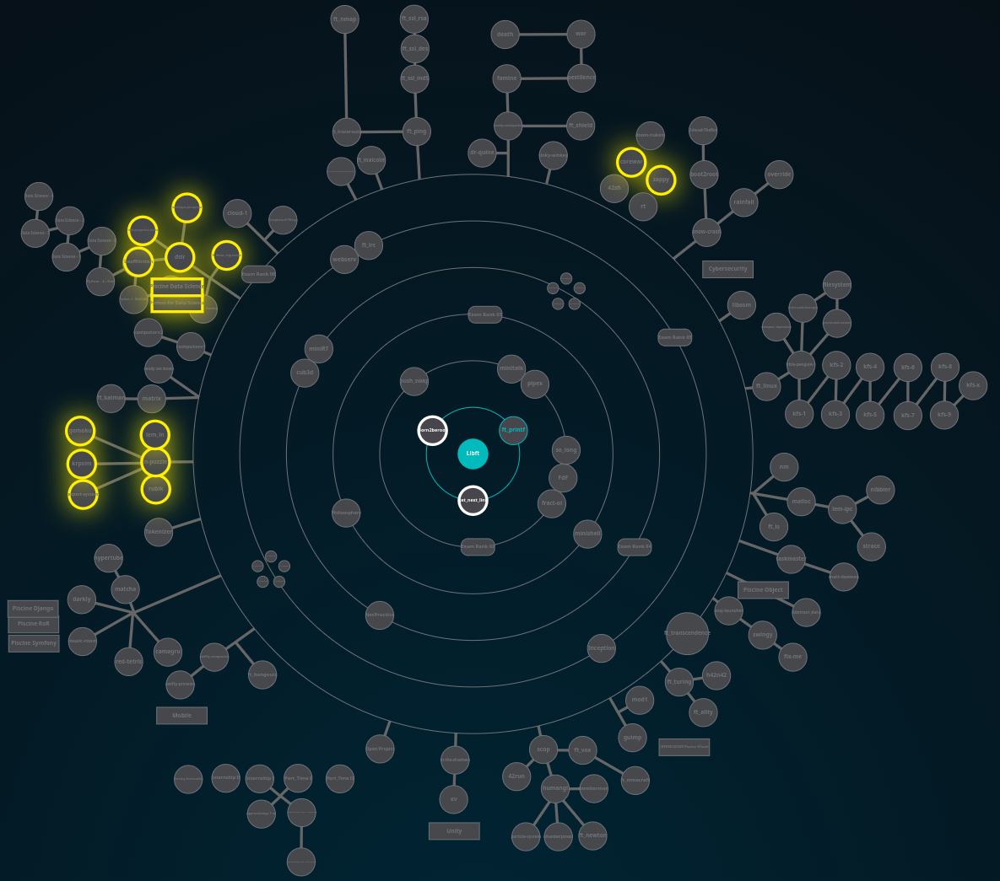

<h1 align="center">
	42
</h1>

	<b>Projects completed at the UK's first 42 programming school</b> 

	
	
	
	

<h3 align="center">
	<a href="#about">What is 42?</a>
	 · 
	<a href="#skills">Skills Developed</a>
	 · 
	<a href="#curriculum">Syllabus</a>
</h3>

"42 already has big supporters in tech like **Snapchat CEO** Evan Spiegel, **Twitter and Square CEO** Jack Dorsey, and **Slack CEO** Stewart Butterfield. Spiegel called it a school from the future, and Dorsey gave a glowing endorsement, saying <i>"We are always looking for great engineers from any background and any education like 42."</i>

Paul Graham founder of Y combinator stated on Twitter <i>**"My God is 42 impressive. This is not another programming bootcamp. It's another MIT."**</i>

42 is a private institution of higher education in computer science first opened in Paris in 2013. The school does not have any professors and is open 24/7. Students are trained through peer-to-peer pedagogy, and project-based learning." (https://en.wikipedia.org/wiki/42_(school))

## 📚 Topics Covered

### Cursus                       Specialisation

|CURSUS	|SPECIALISATION |
|C/C++ language | test|

|CURSUS	|specialisation							|
|:-:	|:--								|
|00		|xpxp|

	* C/C++ language, Makefile      * test
	* Shell scripting               * test
	* Git                           * test
	* Networks
	* Docker
	* SQL
	* Web (HTML, CSS, Wordpress)
	* Computer graphics
	* Assembly language

## 🌟 42's syllabus

**42cursus**  consists of two parts: the "inner circle" and the "outer branches", as in the **Holy Graph** (see image below).

The **inner circle** includes essential projects, each requiring 30 to 100 hours of work. Completing all inner circle projects is considered equivalent to an undergraduate degree in computer science.

The **outer branches**  offer specialized tracks in subjects like operational systems, web development, AI, and algorithms. Completing projects in these treks is equivalent to mastering these areas, similar to graduate-level courses.

### Soft-skills

- **Independent Learning**: 42 places a strong emphasis on independent learning. Students develop their knowledge through research, peer interactions, and practical experience, fostering self-sufficiency.

- **Collaboration**: Collaborative work is a fundamental aspect of the program. Certain projects require students to work together, promoting effective teamwork and leveraging diverse skill sets.

- **Effective Time Management**: With 24/7 access to the school, students must excel in time management. This flexibility demands strong time management skills, enabling students to balance their workloads effectively.